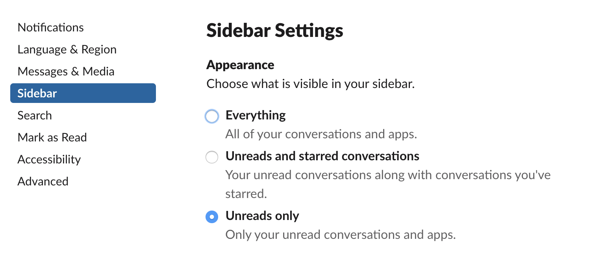
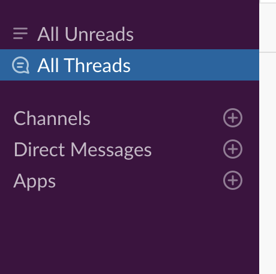
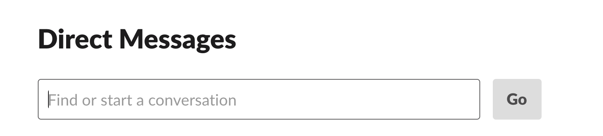

slackは便利だけど、使い方を絞らないと本業の妨げになるので一回整理をしてみた。

### やりたいこと

自分のやるべきことのみに集中して早く仕事を終わらせ、自由な時間を増やしてもっといろんなことに挑戦したい
そのためにslackに流れる些末な情報を自分から追うのを止めてみる

### 僕の本業

- コードを書いて、顧客あるいは自社のビジネスに貢献すること
- コードを書くための仕様をすり合わせて、コードを書けるようにすること

### slackの便利なところ

- webhookを利用してプログラムからslackへ簡単に通知が行える
  - 直近でいうと、golangのloggerにhookできるようにして幸せになりました
    ただし、乱発厳禁。然るべきとこでのみ発砲する。
- 自分へダイレクトメッセージを送ることでメモとして使える
- チャットなので堅苦しくなくラフにコミュニケーションがとれる(経験上)

### 問題

- slackで参加しているチャンネルが多いため、ついついチャンネルを見てしまい、集中が削がれるし、本業に割く時間が削られる
  - 僕は、流れてくるものを見ないという選択ができない人間。例えば、追っている週刊誌を見逃すことができない。故にslackも参加しているチャンネルがあれば定期的に見に行ってしまう
  

### やったこと

- 不要なチャンネルを抜ける
  - 製品、プロジェクト、チームなど僕に **絶対必要な情報** が流れてくるチャンネル以外からは離れる
  - 抜けるというのが大事で、抜けないとmuteはサイドバーに表示されるのでついついクリックしてしまう

- サイドバーの設定を変える
  - 読んでないチャンネルのみ表示させることで、自分が見るべきものだけがわかる
  - これをやらないとチャンネルが羅列されたままなので、slack開いたときに目に入る情報が多くて鬱陶しい
  

- ブラウザでslackみるのをやめる
  - ブラウザのタブにslackがあるととりあえず見とくかとなーとページを開いてしまうのでslackへ意識が及ばないようにした。よっぽど僕に用があるとなれば直接いいにくるだろうし、それ以外の要件は緊急度が低いと割り切りたいので。(僕の業務範囲では、リモートの人とやり取りすることはほぼないです)

### 整理にあたっての学び

- slackのショートカット便利
  - ダイレクトメッセージには Cmd + Shift + k

  - 既存のチャンネルには Cmd + k

一旦これで自分の生産があがるかやってみる。
