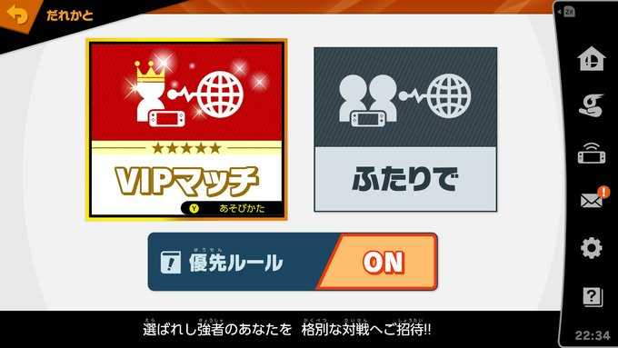
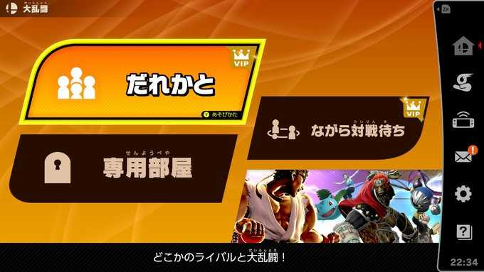
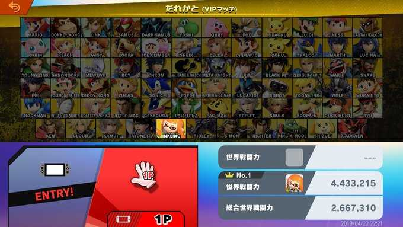

## このページについて

2019/04/18に晴れてVIPに入ることができたので、どうやったらVIPに入れたかを紹介する

## スマブラVIPとは

オンライン対戦で上位の成績の人同士がマッチする部屋のこと
nintendo switchで遊べるスマブラSPではオンライン対戦に世界戦闘力と呼ばれるレートがあり
そのレートが上位3%になるとVIPの部屋に入ることができる




僕が入ったときは437万くらいがボーダーだった



今(2019/04/24)の世界戦闘力TOPが460万なのでまだ3%くらいには入っている

## VIPに入るまでの道のり

### 僕の実力について

まず、筆者のスマブラ経歴は、64とwii版を持っていた程度   
wii版をやりこんでいるわけでもなく、オンライン対戦は今回が初めて  
なので、スマブラ初心者といっていいだろう
そんな初心者が3ヶ月でVIPにたどり着くまでの紹介をする(上達が早いかはわからない)

### やったこと

1月に購入してから1ヶ月はひたすらCPU level9と戦っていた  
このCPUが本当に強くて、買った当初は1%くらいの確率でしか勝てなかったと思う
キャラクターはマリオを使っていて、リーチの短いキャラでも安定して勝てるようになれば  
メインで使いたいルキナ(剣士キャラ)のリーチを最大限活かせるんじゃないかと考えていた  
実際にこの練習法は結構よくて、ルキナを使えるようになったら相手に攻撃当たる回数がとても増えて  
多少楽にCPUに勝てるようになった。  

しかし、1ヶ月ほどやってもCPUとの戦績は7~8割の勝率
安定しなかったが、勝てるようにはなってきたのでオンラインでの対戦をやってみることに
仕事が忙しく、オンラインを始めたのは3月ごろ。対人はCPUよりはるかに難しく  
世界戦闘力は100万以下になることも多かった。(当時のVIPボーダーは400万くらい)
なぜ勝てないかを一旦考え直して、それを意識して対戦をするようにした。具体的には下記。

- 間合いに気をつける
  - ジャンプ攻撃で相手眼の前で終端しないようにする(つかみの攻撃を受けないように)
  - なるべく相手の後ろに回り込む(つかみの攻撃を受けないように)
  - 無理に相手に攻撃を仕掛けない
    - ふっとばされたら距離をとって体制を整え直す
    - 相手は追撃を狙ってるので逃げられるのが一番イヤ
- 必ずつながるコンボを練習する
  - Aという攻撃のあとにBが必ず当たるのがゲーム上保証されているなら
    それを取りこぼさないよう、体に操作を刻み込む
- ガードをちゃんと使う
  - ジャンプで躱して相手に突っ込まない
    - 相手はジャンプを読んで攻撃をおいている。。

これは、どうも対戦中に相手からガード -> つかみを受けることが多かったので対策を講じた
ただ、上位勢は後ろ向きでガードしていても空中後ろ攻撃で切り替えされるので  
ガードを読んでいくことも重要
要は、相手の間合いに飛び込まないことが重要。対戦中の立ち回りを慎重にした。  
対戦ゲームは相手の技をみてカウンターを入れることが重要だと気づいた。

だが、どうしてもルキナでは上に登っていくことができず、メインキャラをインクリングに変えた。
スマブラというゲームの仕様上、スマッシュ攻撃など相手を撃墜させる技を当てないと勝っていけないわけだがその攻撃は上位になると中々当たらない  
その点、インクリングはダメージ％が増えた状態で相手に当てると硬直させる技があり、そこでスマッシュを問答無用に打ち込むことができる
僕は、このやりかたで今まで戦ってきた相手を屠ってきた
どうしてもVIPに行きたい人は、慎重な立ち回りと立ち回りと横Bのローラーを正確に叩き込めばいいと思う

インクリングでVIPが見えてくる(世界戦闘力400万前後)と段々相手の１手先を読めるようになってきたのでゲーム内での反射速度に思考が追加された
具体的には、相手の行動に対して、僕がこう動けば、相手はこう動くから、あそこに攻撃を差し込もうということができるようになった
ゲームやりはじめのときは相手に攻撃を当てるのに精一杯だったが、相手に攻撃を当てるパターンを見つけられるようになった  
初心者が上級者に勝てないのは、キャラを動かす精度と相手の動きを読む能力に差があるからだと思う

そんなこんなで慎重に相手と戦うこと(自分本意にならない)、相手の動きを読んで攻撃を差し込むを意識し動きを洗練させることでなんとか4月にVIPに入れた

結局ゲームでも自分の理想の動きができるまで練習を続けること、なぜできないか考えてそれを解決すること、丁寧にやること(立ち回り)が大事だとわかった。
仕事につながるかというと `No` だけれど、何事も上達するためには考えて、手を動かして繰り返すというのは共通しているなと思った次第。

ちなみに、実力のチャート的には

```
初心者 --(がんばれば超えられる壁)-- VIP --(かなり頑張らないと越えられない壁)-- VIP上位勢 --(?壁)-- 大会ランカー
```

かなと。VIP上位勢にはなったことがないし、そこまでやり込む気力はないので、そこと世界大会にでるようなランカーとの差はわからない。
